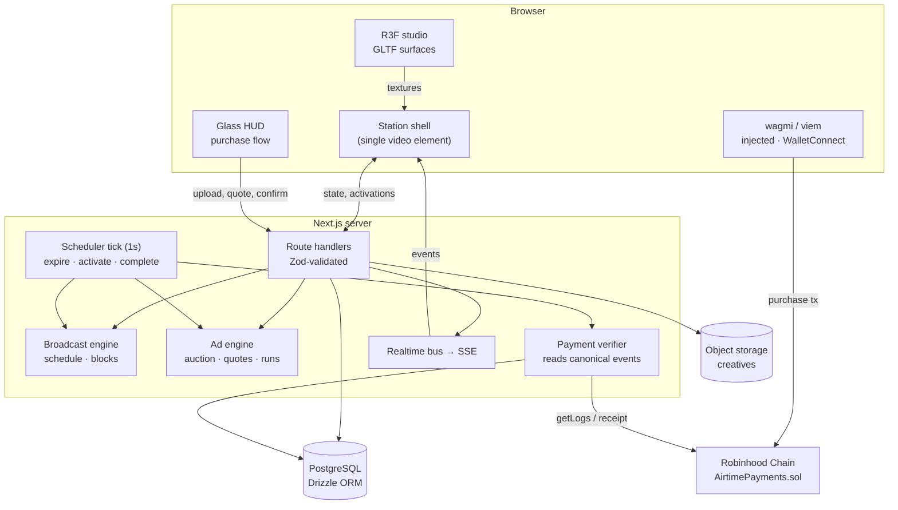
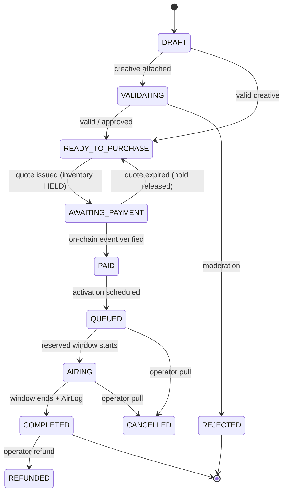
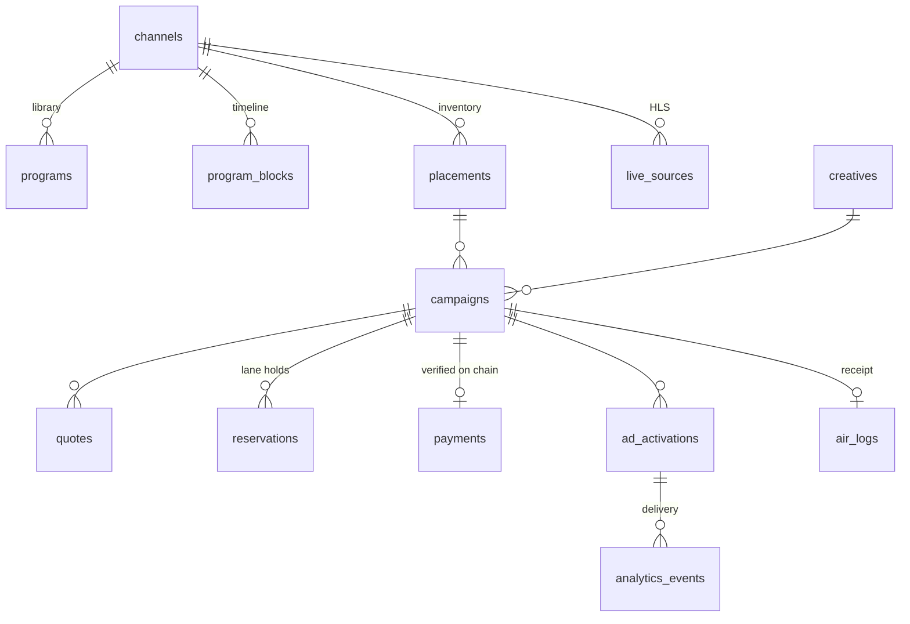

# AIRTIME

A browser-native, 24/7 linear television network where **every display surface is programmable advertising inventory**, paid for on **Robinhood Chain**.

Everything the network earns — airtime revenue and token tax — is used to buy **Anduril pre-stock**, which is then distributed to holders. The [treasury page](#treasury) shows income in, pre-stock bought and pre-stock distributed.

Open the homepage and you are already watching the station. The live picture is the splash: it plays full-bleed behind the fold exactly as it is going out, and everything that explains the network is stacked underneath it in full-width slices. The page is plain 2D - no WebGL - so it behaves the same on every device.

You are not buying a thirty-second spot. **Every surface runs a continuous descending auction.** It asks a price that falls with time; pay it and the surface is yours, on air, until somebody pays more than you did. A sale ratchets the ask up to twice what you paid and time walks it back down again, so a wanted surface gets expensive and an unwanted one gets cheap. Payment settles on chain; the station verifies the on-chain event itself, puts the run on air immediately, and issues an **AirLog** receipt when it ends.

> AIRTIME is an independent product. Robinhood Chain is used as payment infrastructure.

---

## Contents

- [What is actually built](#what-is-actually-built)
- [Architecture](#architecture)
- [Local development](#local-development)
- [Database](#database)
- [Media and storage](#media-and-storage)
- [Robinhood Chain configuration](#robinhood-chain-configuration)
- [Contract deployment](#contract-deployment)
- [Testnet faucet workflow](#testnet-faucet-workflow)
- [Treasury](#treasury)
- [How synchronized television works](#how-synchronized-television-works)
- [How BillboardSurface works](#how-billboardsurface-works)
- [How to create a new placement](#how-to-create-a-new-placement)
- [How payments are verified](#how-payments-are-verified)
- [Security model](#security-model)
- [Performance](#performance)
- [Testing](#testing)
- [Production deployment](#production-deployment)
- [Deploying to Railway](#deploying-to-railway)
- [Deploying to Vercel](#deploying-to-vercel)
- [Environment variables](#environment-variables)
- [Routes](#routes)

---

## What is actually built

| Area | Status |
| --- | --- |
| Synchronized linear TV engine (VOD, HLS, ad breaks, bumpers, operator interrupts) | Working |
| Data-driven placement / inventory system (no hardcoded surfaces) | Working |
| 3D studio with GLTF-driven surfaces, live textures, camera choreography | Working |
| WYSIWYG creative preview on the real surface (3D and 2D) | Working |
| Continuous descending-price auction per surface, server-authoritative, EIP-712 signed quotes | Working |
| Inventory holds, expiry, double-booking prevention (transactional) | Working |
| On-chain payment + independent server-side event verification | Working |
| Automatic activation, completion and AirLog generation | Working |
| Public board of surfaces, program guide, campaign and AirLog pages | Working |
| Control room: programming, placements incl. visual editor, moderation, payments, audit | Working |
| Treasury: derived airtime revenue + operator-recorded pre-stock ledger | Working |
| House showcase cards on unbooked surfaces (always badged EXAMPLE) | Working |
| Privacy-conscious first-party delivery analytics | Working |
| Non-WebGL fallback, reduced motion, mobile layout | Working |
| Foundry contract tests, unit/API tests, Playwright end-to-end | Working |

---

## Architecture



### Purchase sequence

```mermaid
sequenceDiagram
    autonumber
    participant U as Advertiser
    participant W as Wallet
    participant A as AIRTIME server
    participant C as AirtimePayments
    participant S as Scheduler

    U->>A: Sign in with Ethereum (SIWE)
    U->>A: Upload creative
    A->>A: Sniff magic bytes, decode, re-encode, hash (keccak256)
    U->>A: Take the surface at the current ask
    A->>A: TX: lock placement, refuse if held or inside a guaranteed run, read the ask, HOLD (~3 min)
    A-->>U: EIP-712 signed Quote (quoteId, creativeHash, guaranteed window, amount, nonce)
    U->>W: purchase(quote, signature)
    W->>C: tx with msg.value == amount
    C->>C: verify signature, buyer, expiry, nonce, chain, token, placement availability
    C->>C: protect placement through the guaranteed window; a racing loser reverts before value moves
    C-->>C: emit AirtimePurchased(...)
    C->>C: forward funds to treasury
    U->>A: hint tx hash (optional)
    A->>C: read receipt / logs from its own RPC
    A->>A: match quoteId, buyer, placement, creativeHash, token, amount, window
    A->>A: PAID → AIRING at once, outbidding whoever paid less for the surface
    A->>A: the ask resets to 2x the price paid and starts descending again
    S->>S: when a higher bid lands → COMPLETED + AirLog for the outgoing run
```

### Campaign lifecycle



### Where things live

```
contracts/            Foundry project (AirtimePayments.sol + tests + deploy script)
drizzle/              Generated SQL migrations
public/models/        studio.glb (built from scripts/build-studio-gltf.ts)
scripts/              build-studio-gltf, migrate, seed, reset, deploy-local, worker
src/app/              Routes: station, watch, guide, queue, airtime, campaign, airlog, control-room, api/*
src/components/
  station/            Player engine (pure), player, overlays, analytics, shell
  studio/             R3F studio: BroadcastStudio, BillboardSurface, BroadcastScreen,
                      StudioMonitor, InteractiveMesh, CameraRig, EnvironmentalLights,
                      ReflectionSurface, BroadcastTicker3D, PlacementHighlight, textures, perf
  hud/                Status rail, wallet, broadcast log, guide, inventory, buy control, panels
  airtime/            Purchase flow, creative upload, airtime picker, 2D preview, wallet hooks
  control-room/       Admin API hooks, UI primitives, visual placement editor
src/server/
  broadcast/          Linear schedule engine
  ads/                auction · quotes · campaigns · creatives · activation (runs)
  chain/              RPC client, EIP-712 quote signer, payment verifier
  media/              validation (magic bytes, MP4 parser), storage, media provider
  db/                 Drizzle schema, client (Postgres or embedded PGlite), seed
  auth/               SIWE + admin sessions, signed upload tickets
  worker/             Scheduler tick
tests/                unit · api · e2e
```

---

## Local development

Requirements: **Node 20+**, **pnpm**, and (for the payment path) **Foundry**.

```bash
pnpm install
```

Everything below runs without Docker or a Postgres install: with `DATABASE_URL` empty the app uses **PGlite**, real Postgres compiled to WASM, stored in `./.pglite`.

### 1. Build the studio model

```bash
pnpm studio:build
```

Writes `public/models/studio.glb` (a real glTF binary, ~132 KB, 72 meshes, 19 named display surfaces) plus `studio.meshes.json` used by the control room.

### 2. Start a local chain and deploy the payment contract

```bash
anvil --chain-id 31337 --block-time 1
```

```bash
pnpm contract:build
pnpm contract:deploy:local
```

`contract:deploy:local` deploys `AirtimePayments`, wires anvil account #9 as the quote signer (matching the development fallback key) and writes the address into `.env.local`.

### 3. Run the station

```bash
pnpm dev
```

Open <http://localhost:3000>. On first boot the app migrates, seeds placements, creates the admin user and fills 12 hours of programming with public open-movie sources labelled **DEV DATA**.

The console prints the admin credentials (defaults to `admin@airtime.local` / `airtime-dev`). The control room is at `/control-room`.

To buy airtime locally, connect the **AIRTIME Dev Wallet** connector (anvil account #1, enabled by `NEXT_PUBLIC_DEV_WALLET_PRIVATE_KEY`) — no browser extension needed.

### Development simulation clock

Reserved airtime is minutes away, which is inconvenient to test. In **Control room → Settings** you can jump the station clock forward or back. The offset is persisted, applied to playback offsets, quote expiry, activation and completion, and every connected browser re-syncs immediately.

```bash
pnpm db:reset   # wipe the embedded database and local uploads
pnpm db:seed    # migrate + seed without starting the server
```

---

## Database

PostgreSQL via **Drizzle ORM**. Schema: `src/server/db/schema.ts`; migrations in `drizzle/`.



Rules the schema enforces:

- **Money is never a float.** On-chain amounts are `numeric(78,0)` (wei) and handled as `bigint` in code. Multipliers are integer basis points.
- **All timestamps are UTC** (`timestamptz`).
- `payments` has unique indexes on `quote_id` and on `(tx_hash, log_index)` — a purchase can be recorded exactly once.
- `reservations` carry a `lane`; two reservations in one lane may never overlap while `HELD` (unexpired) or `CONFIRMED`.

Changing the schema:

```bash
pnpm db:generate     # drizzle-kit generate
pnpm db:migrate      # apply
```

For a real Postgres, set `DATABASE_URL` and run `pnpm db:migrate`.

---

## Media and storage

Advertiser uploads are treated as hostile input:

1. Size checked against the placement limit.
2. **Type sniffed from magic bytes** (`file-type`) — the client's MIME and extension are never trusted, and the claimed extension must agree with the real content.
3. Images are decoded and **re-encoded** with `sharp`, which strips metadata and any embedded payload, and downscaled to the placement's maximum.
4. Videos are parsed by a small in-repo **ISO-BMFF reader** (`src/server/media/mp4.ts`) for real duration, dimensions, codec four-cc and audio-track presence. Only H.264/AV1 MP4 is accepted.
5. Text creatives are stripped of control characters and length-limited.

HTML and JavaScript creatives are **not supported at all** — there is no code path that renders advertiser markup.

`StorageProvider` (`local` or any S3-compatible bucket, signed with SigV4 over plain `fetch`) and `MediaProvider` (renditions/posters) are interfaces, so a hosted video pipeline can be dropped in without touching the rest of the system. Locally stored creatives are served by `/media/[...key]` with a fixed content type, `nosniff`, `sandbox` CSP and byte-range support.

---

## Robinhood Chain configuration

| | Mainnet | Testnet |
| --- | --- | --- |
| Name | Robinhood Chain | Robinhood Chain Testnet |
| Chain ID | `4663` | `46630` |
| Native currency | ETH | ETH |
| Public RPC | `https://rpc.mainnet.chain.robinhood.com` | `https://rpc.testnet.chain.robinhood.com` |

Select the network with `NEXT_PUBLIC_CHAIN_ENV=local | testnet | mainnet`.

**Do not hammer the public RPC in production.** Point `ROBINHOOD_MAINNET_RPC_URL` / `ROBINHOOD_TESTNET_RPC_URL` at a dedicated provider (Alchemy or similar); the server batches requests and the payment watcher only scans from the block a quote was issued at.

Wallets: any injected EVM wallet, plus WalletConnect when `NEXT_PUBLIC_WALLETCONNECT_PROJECT_ID` is set. Robinhood Wallet connects through those standard flows. If the wallet is on the wrong network, the UI offers a **Switch to Robinhood Chain** action.

Payment assets: **native ETH works out of the box.** ERC-20 support exists in the contract (`SafeERC20`, owner-allowlisted) and in the client asset list, but an ERC-20 only becomes selectable once its **real, verified** contract address is configured (e.g. `NEXT_PUBLIC_USDG_ADDRESS`). No token addresses are invented anywhere in this repository.

---

## Contract deployment

`contracts/src/AirtimePayments.sol` is deliberately small: verify a signed quote, atomically protect its placement for the guaranteed window, take payment once, emit the canonical event, and forward funds. No scheduling, media or creative logic lives on chain.

```bash
cd contracts
forge build
forge test -vv          # replay, expiry, tampering, placement races, wrong chain, pause, fuzz
```

Deploy to Robinhood Chain Testnet:

```bash
export DEPLOYER_PRIVATE_KEY=0x...
export QUOTE_SIGNER_ADDRESS=0x...   # address of AIRTIME_QUOTE_SIGNER_PRIVATE_KEY
export TREASURY_ADDRESS=0x...
export ROBINHOOD_TESTNET_RPC_URL=https://rpc.testnet.chain.robinhood.com

pnpm contract:deploy:testnet
```

Then set `NEXT_PUBLIC_AIRTIME_PAYMENT_CONTRACT` and `AIRTIME_PAYMENT_CONTRACT_DEPLOY_BLOCK` in the environment. The control room shows the live contract, quote signer and treasury so a mismatch is immediately visible.

Rotating the backend signing key is `setQuoteSigner(newSigner)`; previously signed quotes stop being accepted (covered by a test).

---

## Testnet faucet workflow

1. Add Robinhood Chain Testnet to your wallet: chain id `46630`, RPC `https://rpc.testnet.chain.robinhood.com`, currency ETH.
2. Fund the deployer and a buyer address from the Robinhood Chain testnet faucet.
3. Deploy the contract as above; keep the deployment block.
4. Set `NEXT_PUBLIC_CHAIN_ENV=testnet` and the RPC/contract variables, then start the app.
5. Buy a placement. The station reads the `AirtimePurchased` event from its own RPC before the campaign becomes `PAID`.

---

## Treasury

A configured share of network income (100% by default) buys Anduril pre-stock for distribution to holders. Two kinds of number meet on `/treasury`, and the distinction is enforced in the code:

| | Source | Can the site prove it? |
| --- | --- | --- |
| Airtime revenue | Derived from confirmed payments, each verified against an on-chain `AirtimePurchased` event | Yes |
| Token tax received | Recorded by the operator in the control room | No — shown as a recorded figure with an optional reference |
| Anduril pre-stock bought | Recorded by the operator (happens through a broker) | No |
| Distributed to holders | Recorded by the operator | No |

Nobody can type in airtime revenue, and the operator ledger never pretends to be chain data. Distributions are refused if they exceed the pre-stock recorded as held. The allocation percentage is set in **Control room → Settings**, and entries are added in **Control room → Treasury**. Every entry is written to the audit log.

The page carries an explicit disclosure: it is not an offer, a prospectus, or investment advice.

### Showcase cards

Surfaces nobody has booked can show a house **showcase card** so an empty network still demonstrates what the billboards do. These are drawn procedurally from text only — no third-party artwork — and always carry a permanent **EXAMPLE** badge plus "this space is available". They never enter the public board, never produce an AirLog, and are not counted as revenue. Cards live in the `showcase_creatives` table, seeded against the two studio billboards; every other surface is deliberately left bare so genuine availability is obvious.

## How synchronized television works

Programming is a timeline of `program_blocks` per channel — never "autoplay a random video".

```mermaid
gantt
    dateFormat HH:mm
    axisFormat %H:%M
    title MAIN channel timeline
    section Timeline
    Big Buck Bunny (VOD)      :a1, 00:00, 10m
    Commercial break (AD_BREAK) :crit, a2, after a1, 2m
    Tears of Steel (VOD)      :a3, after a2, 12m
    Breaking (LIVE_HLS, manual) :active, a4, after a3, 2m
```



- Every viewer asks the server for the block at `serverNow()` and seeks to `offset = now − block.startsAt` (plus a `resumeOffsetSec` when an interrupt split the block). Everyone sees the same frame.
- The browser **never trusts its own clock**: `useServerClockSync` measures round-trip time against `/api/time` and keeps the lowest-latency offset sample, re-sampling every 30 s.
- Drift is corrected continuously: under 0.35 s nothing happens, up to 2.5 s the playback rate is nudged (±6 %), beyond that the player seeks. Logic lives in `playerEngine.ts` and is unit-tested.
- `LIVE_HLS` blocks use native HLS where available and `hls.js` otherwise. VOD delivered over HLS is still offset-synchronised.
- During an `AD_BREAK`, the full-screen campaign that owns that window takes the main stream (video or image); if nothing is booked, a house slate names the next program.
- An operator can interrupt at any moment (`insertManualBlock`): overlapping blocks are trimmed or split, and the timeline resumes afterwards. `ensureScheduleHorizon` keeps 12 hours of programming ahead by rotating the channel library with ad breaks between programs.
- Channel-changing architecture exists (`MAIN`, `MARKETS`, `MUSIC`, `COMMUNITY`, `AFTER_HOURS` are seeded); V1 ships with `MAIN` active.

No fabricated "live viewer" counts appear anywhere.

---

## How BillboardSurface works

`<BillboardSurface>` maps a dynamic image/video texture onto a **named GLTF mesh** — or onto its own plane when the placement is positioned by transform instead.

```tsx
<BillboardSurface
  placement={placement}          // data from the database
  surface={surfaces["Billboard_Left"]}
  campaign={activeCampaign}      // paid campaign currently on air, or null
  preview={previewCreative}      // advertiser's WYSIWYG preview, or null
  allowVideo={tier.videoSurfaces}
/>
```

What it does:

- Chooses what to display: **preview → paid campaign → AIRTIME house graphic**. Unsold surfaces show a procedural house card, never a fake advertisement.
- Builds the texture (image baked into a canvas with true-black letterboxing for `FIT`, `repeat`/`offset` cropping for `FILL`, or a `VideoTexture` seeked to the campaign's own offset).
- Cross-fades in place when the campaign changes — **no page reload** — and disposes the previous texture 500 ms later.
- Pauses video textures that face away from the camera, are far away, or when the tab is hidden.
- Raycast hover produces a very subtle emissive edge plus a small contextual label; clicking dollies the camera toward the surface and opens the purchase panel beside it.
- Disposes its material and textures on unmount.

The main display (`<BroadcastScreen>`) shares the station player's single `<video>` element as a `VideoTexture`, so the 2D picture and the 3D screen can never disagree, and hosts the overlay placements (lower third, sponsor bug) as planes in front of it.

---

## How to create a new placement

Nothing about inventory is hardcoded. Two ways to add a surface:

**From the control room (no code):** `/control-room/placements → New`. Give it an id, type, aspect ratio, media types and auction rules, and either pick a **GLTF mesh** (`Pick` lets you click any mesh in the live studio) or leave the mesh empty and place it with the transform gizmo. Save; the studio picks it up over the realtime bus and it becomes buyable immediately.

**From code (seed):** add an entry to `BASE_PLACEMENTS` in `src/server/db/seed.ts`.

Fields that matter:

| Field | Meaning |
| --- | --- |
| `type` | `FULLSCREEN` (owns the main stream during ad breaks), `OVERLAY`, `ENVIRONMENT` (3D surface), `SPONSORSHIP` |
| `kind` | Free-form sub-kind that drives overlay layout: `commercial`, `lower_third`, `ticker`, `sponsor_bug`, `billboard`, … |
| `lane` | Exclusivity group. Reservations in one lane may never overlap; overlays designed to coexist simply use different lanes |
| `ownsMainStream` | An airing campaign here replaces the main broadcast picture. This is what makes commercials, channel takeovers and sponsored station-ID bumpers work without special-casing a placement type |
| `meshName` | GLTF mesh to map the texture onto, or `null` for a transform-placed plane |
| `transform` | Position / rotation / scale for mesh-less placements (edited with the gizmo) |
| `availability.inventoryMode` | `CONTINUOUS` (the occupant is on the surface the whole time it holds it) or `AD_BREAK` (the occupant owns the picture during every commercial break) |
| `auction.openingPriceWei` / `auction.floorPriceWei` | Where the ask starts on a surface that has never sold, and the level it never decays below |
| `auction.decaySeconds` | How long the ask takes to walk from the top of a descent down to its floor, linearly |
| `auction.takeoverPremiumBps` | Where the ask restarts after a sale: 20000 = 2x what the buyer paid |
| `auction.minIncrementBps` | How much a challenger has to beat the occupant by: 500 = +5% |
| `auction.minHoldSeconds` | Runtime a buyer is guaranteed before anybody can outbid them |
| `auction.maxHoldSeconds` | Hard cap on a single run. 0, the default, means it runs until outbid |
| `requiresModeration` | Campaign cannot be quoted until a moderator approves the creative |
| `maxWidth/maxHeight/maxFileBytes/allowsAudio/allowsClickThrough` | Creative rules enforced during validation |

Seeded placements — one screen, one panel either side, four things to buy:

| Placement | What it is | Length | Opens at |
| --- | --- | --- | --- |
| `SHOW` | The picture itself, whenever a break is not on | up to 30 minutes | 0.01 ETH |
| `AD` | The picture during every commercial break | up to 30 seconds | 0.01 ETH |
| `PANEL_LEFT` | The panel left of the picture, always on | up to 30 seconds | 0.01 ETH |
| `PANEL_RIGHT` | The panel right of the picture, always on | up to 30 seconds | 0.01 ETH |

Everything opens at the same price and the market separates them. A show is worth more than a spot, so a show clears higher — nothing in the code makes it so.

### Submitting a show

A show is up to half an hour, which is not something anybody wants to push through an upload form, so a submission can be a **link** instead. The station fetches it itself before it will sell airtime against it: it refuses private addresses and plain http, reads the content type, parses the MP4 container or sums the HLS playlist for the real running time, and checks the origin sends CORS headers so the frame can be copied into the WebGL texture. The URL is what gets hashed into the quote, so the buyer is committing to that exact address.

Direct video (`.mp4`, `.webm`) and HLS (`.m3u8`) play. A watch page — YouTube, Vimeo, Twitch — is rejected with an explanation, because playing one means embedding somebody else's player, and no third-party markup or script is ever loaded into this station.

The shipped studio (`public/models/studio.meshes.json`) is deliberately spare: four sellable surfaces — `Screen_Main`, `LED_Ribbon`, `Billboard_Left` and `Billboard_Right` — all facing the viewer square on, plus the architecture and lighting around them. Earlier layouts had an anchor desk, wing walls, a rear video wall and a wall of small monitors; they were removed because inventory nobody can read is not worth selling. Add a mesh in `scripts/build-studio-gltf.ts` with `extras.surface` and it becomes sellable the moment a placement points at it.

---

## How payments are verified

**The browser never decides that something is paid.**

1. The backend signs an EIP-712 `Quote` binding `quoteId`, `buyer`, `placementId` hash, `creativeHash`, `startAt`, `endAt`, `paymentToken`, `amount`, `expiresAt`, `nonce`. The domain separator includes `chainId` and the contract address, so a quote cannot be replayed on another chain or deployment.
2. `AirtimePayments.purchase()` re-checks the signature, caller, expiry, quote id, buyer nonce, token support and exact amount. It then protects that placement through the signed guaranteed window, records the quote as consumed, forwards funds to the treasury and emits `AirtimePurchased`.
3. If valid payments for the same placement race, chain ordering makes one the winner. Every later transaction inside that protected window reverts before native currency or tokens transfer, so the losing payment value remains in its buyer's wallet (ordinary transaction gas can still be charged).
4. The browser may **hint** a transaction hash. The server uses it only as a lookup key: it fetches the receipt from its own RPC, requires a successful receipt, finds an `AirtimePurchased` log **emitted by the configured contract address**, and re-checks quote id, buyer, placement hash, creative hash, token, amount and time window against the quote it signed, then requires N confirmations.
5. The same verification runs from the scheduler every few seconds without any browser involvement (`pollAwaitingPayments`), so closing the tab cannot lose a payment. Expired quotes keep a short grace window because the contract itself honours a transaction mined within the quote's validity.
6. Only then: `PAID → QUEUED`, hold becomes `CONFIRMED`, activation scheduled, realtime event published.

A pending transaction is never treated as paid, and `payments` unique indexes make double-recording impossible.

---

## Security model

- **Advertiser content is hostile input.** No HTML, no JavaScript, no iframes. Files are sniffed, decoded, re-encoded and re-hashed server-side; the creative that airs is the one whose hash was signed into the quote and emitted on chain.
- **Strict CSP** with a per-request nonce (`src/proxy.ts`): `object-src 'none'`, `frame-ancestors 'none'`, explicit allowlists for RPC, media and wallet origins. Creatives are served sandboxed with `nosniff`.
- **Authentication:** advertisers sign in with SIWE (single-use, expiring server-issued nonces; EOA and ERC-1271 signatures). Admins use email + bcrypt password. Both are HttpOnly, SameSite=Lax, Secure-in-production JWT cookies. Admin routes are gated in the proxy **and** re-verified in every handler.
- **Uploads** require a signed, short-lived upload ticket bound to wallet + placement, on top of the session.
- **All API input is validated with Zod.** State-changing endpoints check same-origin and are rate limited per IP.
- **Secrets never reach the browser:** the quote signer key, session/upload secrets and storage credentials are server-only. The signer key holds no funds; the treasury is a separate address configured on the contract.
- **Every administrative mutation is written to `audit_logs`** with actor, action, target and details.
- **Filenames are sanitised** and storage keys are validated against path traversal.
- Analytics stores only a daily-salted hash of a per-tab random id: no cookies, no cross-day joins, no PII.

---

## Performance

- The television starts immediately in the DOM; the studio is a lazy `next/dynamic` import and never blocks playback. The 2D picture hands over to the 3D screen only once the scene reports ready.
- Three performance tiers are chosen from device hints (cores, memory, mobile, save-data) and lowered at runtime by `PerformanceMonitor`: DPR cap, planar reflection resolution, post-processing, shadow map size, environment resolution and whether video textures run at all.
- One `<video>` element feeds both the DOM player and the 3D main screen and monitors, instead of one decoder per surface.
- Textures and materials are disposed on change and unmount; offscreen video textures pause.
- The studio model is ~132 KB; the landing payload is nowhere near tens of megabytes.
- `prefers-reduced-motion` removes parallax and makes transitions instant; mobile uses a simplified camera rig and keeps the scene.

---

## Testing

```bash
pnpm test            # Vitest: the price curve, player sync, MP4 parser, full API integration
pnpm contract:test   # Foundry: replay, expiry, same-placement races, wrong chain, fuzz
pnpm test:e2e        # Playwright: the complete vertical slice against a local chain
```

The integration suite (`tests/api/inventory.test.ts`) runs against a real in-memory Postgres and covers creative validation (including a disguised HTML file), quote signing and verification against the contract's EIP-712 domain, inventory holds, **concurrent quotes for the same window where exactly one wins**, quote expiry releasing inventory, full-field event-matched payment authorization, replay rejection, activation, completion, AirLog contents and schedule synchronisation. The contract suite separately proves that a racing same-placement loser transfers no payment and that the placement becomes purchasable again after the protected window.

The Playwright suite deploys `AirtimePayments` to a fresh anvil chain, builds and starts the production server, then drives the browser through: watch the station → open a studio billboard → sign in → upload a creative → preview it → read the live descending ask → receive a quote → pay with a local wallet → server verifies the on-chain event → the run is on air immediately and the surface reports its occupant and its new takeover price → the buyer hands the surface back → AirLog page renders with the transaction.

---

## Production deployment

1. **Database:** provision Postgres, set `DATABASE_URL`, run `pnpm db:migrate`.
2. **Storage:** set `STORAGE_PROVIDER=s3` with bucket, region, endpoint, credentials and a CDN `STORAGE_PUBLIC_BASE_URL`.
3. **Chain:** deploy the contract, set `NEXT_PUBLIC_AIRTIME_PAYMENT_CONTRACT`, `AIRTIME_PAYMENT_CONTRACT_DEPLOY_BLOCK`, a dedicated RPC URL and `AIRTIME_PAYMENT_CONFIRMATIONS` (2+ on mainnet).
4. **Secrets:** generate `AIRTIME_SESSION_SECRET`, `AIRTIME_UPLOAD_SECRET`, `AIRTIME_QUOTE_SIGNER_PRIVATE_KEY` and `ADMIN_PASSWORD`. The app refuses to start in production without them.
5. **Dev data:** set `AIRTIME_SEED_DEV_DATA=false`. Seeded programming is refused on mainnet regardless.
6. **Scheduler:** exactly one instance must run the ticker. Either run a single web instance, or set `AIRTIME_DISABLE_TICKER=true` on the web tier and run `pnpm worker` once.
7. **Realtime:** the SSE bus is in-process. For multiple web instances, bridge `src/server/realtime/bus.ts` to Redis or Postgres `LISTEN/NOTIFY`; the event shapes stay the same.

```bash
pnpm build && pnpm start
```

---

## Deploying to Railway

Railway runs the app as a long-lived container, which suits AIRTIME better than a serverless host: the in-process scheduler works as designed, so no cron is needed, and a volume gives creative uploads a real disk.

```bash
railway init --name airtime
railway add --database postgres
railway add --service airtime
railway domain --service airtime            # note the port it reports
railway volume add -m /data                 # persistent creative storage
railway up --service airtime
```

Set these on the app service before the first build, because `NEXT_PUBLIC_*` values are baked into the browser bundle at build time:

| Variable | Value |
| --- | --- |
| `DATABASE_URL` | `${{Postgres.DATABASE_URL}}` |
| `STORAGE_PROVIDER` / `STORAGE_LOCAL_DIR` | `local` / `/data/storage` (the volume mount) |
| `NEXT_PUBLIC_APP_URL` | the generated domain |
| `NEXT_PUBLIC_CHAIN_ENV`, `ROBINHOOD_*_RPC_URL` | chain selection and RPC |
| `AIRTIME_QUOTE_SIGNER_PRIVATE_KEY`, `AIRTIME_SESSION_SECRET`, `AIRTIME_UPLOAD_SECRET`, `ADMIN_PASSWORD` | required; the app refuses to boot in production without them |

Two things that will bite otherwise:

- **Target port.** Railway injects `PORT` (8080), and `next start` honours it. A generated domain defaults to port 3000, which answers 502. Point it at the port from the boot log: `railway domain update <domain> --port 8080`.
- **pnpm version.** `packageManager` is pinned in `package.json` and `pnpm-workspace.yaml` declares `packages`, because pnpm 9 rejects a workspace file without that field.

The boot log prints the platform, the database in use and which scheduler is active — check it after the first deploy.

## Deploying to Vercel

The repository root is the Next.js app, so Vercel needs no root-directory override — import the repo and it builds. `vercel.json` pins the framework, the pnpm install command, the cron schedule and per-function limits; `.vercelignore` keeps the Foundry project and the test suites out of the deployment.

Three parts of AIRTIME assume a long-lived server with a disk. On Vercel each request gets a short-lived, read-only container, so they are wired differently and the app refuses to start with a configuration that cannot work:

| | Off Vercel | On Vercel |
| --- | --- | --- |
| Database | embedded PGlite on disk | **required:** `DATABASE_URL` to managed Postgres. The embedded fallback is refused with an explanatory error |
| Creative storage | `./storage` on disk | **required:** `STORAGE_PROVIDER=s3` plus bucket, credentials and `STORAGE_PUBLIC_BASE_URL`. Local storage is refused |
| Scheduler | `setInterval` every second | Vercel Cron calls `/api/cron/tick` every minute, and `/api/queue`, `/api/activations`, `/api/board` and `/api/broadcast/state` tick opportunistically (at most once every 4s) so traffic keeps the station moving between firings |

### Setup

1. Import the repository on Vercel. Framework detection is Next.js; leave the root directory at the repository root.
2. Provision Postgres (Vercel Postgres, Neon, Supabase) and set `DATABASE_URL`. Migrations run on boot under a Postgres advisory lock, so simultaneous cold starts cannot race; set `AIRTIME_MIGRATE_ON_BOOT=false` to run them from a deploy step instead.
3. Provision object storage and set the `STORAGE_*` variables.
4. Set the secrets: `AIRTIME_QUOTE_SIGNER_PRIVATE_KEY`, `AIRTIME_SESSION_SECRET`, `AIRTIME_UPLOAD_SECRET`, `ADMIN_PASSWORD` and `AIRTIME_CRON_SECRET`. The app refuses to boot in production without the first four, and the cron endpoint returns 401 without the last.
5. Set the chain variables: `NEXT_PUBLIC_CHAIN_ENV`, a dedicated `ROBINHOOD_*_RPC_URL`, `NEXT_PUBLIC_AIRTIME_PAYMENT_CONTRACT`, `AIRTIME_PAYMENT_CONTRACT_DEPLOY_BLOCK` and `TREASURY_ADDRESS`.
6. Set `AIRTIME_SEED_DEV_DATA=false`. Seeded programming is refused on mainnet regardless.

### What to expect

- **Scheduling granularity.** Cron fires once a minute, so with no traffic a campaign can go on air up to a minute late. Any request to the station tightens that to a few seconds. Slots are on a five-minute grid, so this is within tolerance; for exact-second activation, run the app on a normal server where the in-process scheduler is used.
- **Realtime.** Server-Sent Events streams close after `AIRTIME_SSE_LIFETIME_MS` (50s by default, under the 60s Hobby function limit) and the browser reconnects automatically. On a plan with longer limits, raise that value and `maxDuration` in `vercel.json` together.
- **Cron on Hobby.** Hobby projects only run cron once a day. Minute-level scheduling needs Pro, or an external scheduler calling `/api/cron/tick` with the bearer secret.
- `pnpm worker` is for self-hosted deployments and is not used on Vercel.

The boot log prints the detected platform, the database in use and which scheduler is active, and warns about any configuration that cannot work on the host.

## Environment variables

See `.env.example`. Secrets must never be placed in `NEXT_PUBLIC_*` variables.

| Variable | Purpose |
| --- | --- |
| `DATABASE_URL` | Postgres. Empty in development → embedded PGlite in `./.pglite` |
| `NEXT_PUBLIC_APP_URL` | Public origin |
| `NEXT_PUBLIC_CHAIN_ENV` | `local` · `testnet` · `mainnet` |
| `ROBINHOOD_MAINNET_RPC_URL` / `ROBINHOOD_TESTNET_RPC_URL` | Server-side RPC (use a dedicated provider) |
| `NEXT_PUBLIC_WALLETCONNECT_PROJECT_ID` | Enables the WalletConnect connector |
| `AIRTIME_QUOTE_SIGNER_PRIVATE_KEY` | **Secret.** Signs EIP-712 quotes; holds no funds |
| `NEXT_PUBLIC_AIRTIME_PAYMENT_CONTRACT` | Deployed `AirtimePayments` |
| `AIRTIME_PAYMENT_CONTRACT_DEPLOY_BLOCK` | Lower bound for the payment watcher |
| `AIRTIME_PAYMENT_CONFIRMATIONS` | Confirmations required before `PAID` |
| `TREASURY_ADDRESS` | Where the contract forwards payments |
| `AIRTIME_SESSION_SECRET` / `AIRTIME_UPLOAD_SECRET` | **Secrets.** Session and upload-ticket signing |
| `ADMIN_EMAIL` / `ADMIN_PASSWORD` | Initial control-room account |
| `STORAGE_*` | Storage provider configuration |
| `NEXT_PUBLIC_MEDIA_ORIGINS` | Extra origins allowed by CSP for programming media |
| `AIRTIME_SEED_DEV_DATA` | Seed DEV DATA programming (never on mainnet) |
| `NEXT_PUBLIC_USDG_ADDRESS` | Optional verified ERC-20; unset means not selectable |
| `NEXT_PUBLIC_DEV_WALLET_PRIVATE_KEY` | Development/E2E only local wallet connector |
| `AIRTIME_DISABLE_TICKER` | Disable the in-process scheduler (multi-instance deployments) |
| `AIRTIME_CRON_SECRET` | **Secret.** Bearer token `/api/cron/tick` requires; mandatory in production |
| `AIRTIME_MIGRATE_ON_BOOT` | Run migrations at boot (default true, advisory-locked) |
| `AIRTIME_SSE_LIFETIME_MS` | How long a realtime stream stays open before the client reconnects |

---

## Routes

| Route | Purpose |
| --- | --- |
| `/` | The front page: live picture as the splash, then how it works, the board, treasury, chat and the room |
| `/watch` | 2D station with guide and broadcast log (no WebGL required) |
| `/guide` | Program guide |
| `/station` | The auditorium: the 3D room, the picture and the two panels |
| `/queue` | Public board: who is standing on which surface, and who was outbid off one recently |
| `/airtime` | All inventory, plus your campaigns |
| `/airtime/[placementId]` | Conventional purchase page with WYSIWYG preview |
| `/campaign/[id]` | Campaign status, creative hashes and payment |
| `/airlog/[id]` | Shareable proof-of-air receipt |
| `/treasury` | Income in, Anduril pre-stock bought and distributed |
| `/info` | Public explainer: what the network is, what is for sale, what the chain proves |
| `/docs` | Advertiser and operator documentation |
| `/control-room` | Master control (authenticated) |

API: `/api/time`, `/api/events` (SSE), `/api/treasury`, `/api/showcase`, `/api/broadcast/state`, `/api/broadcast/guide`, `/api/queue`, `/api/activations`, `/api/placements`, `/api/placements/[id]/surface`, `/api/board`, `/api/auth/*`, `/api/creatives*`, `/api/campaigns*`, `/api/analytics`, `/api/airlog/[id]`, `/api/admin/*`.

---

## Sound and content

One `<video>` element carries the whole station: the programme, and whatever a buyer has taken the main picture with. The 3D screen samples that same element, so picture and sound can never disagree, and environment surfaces are always silent. Sound starts muted because browsers refuse to autoplay audio; the control in the status rail unmutes and sets the level, the choice is remembered per browser, and if the autoplay policy refuses an unmuted start the player falls back to muted playback and asks for a click rather than stalling.

Programming is **unrated**. There is no TV rating system, no age gate and no viewer discretion advisory: everything that runs during station time is a user submission that was paid for, and placements flagged `requiresModeration` get a policy check by a moderator, which is not a rating. That disclosure appears on first visit, permanently in the footer, and in full at `/docs#content`.

---

## A note on what the blockchain proves

The chain proves **payment**: that a specific buyer paid a specific amount for a quote bound to a placement, a time window and a content hash. It does not measure viewing.

Delivery numbers on an AirLog come from AIRTIME's own first-party analytics — sessions that had the station open, whether the creative loaded, whether the tab was visible, video completions and clicks. They are presented separately from the payment facts and are never described as verified or on-chain impressions.
